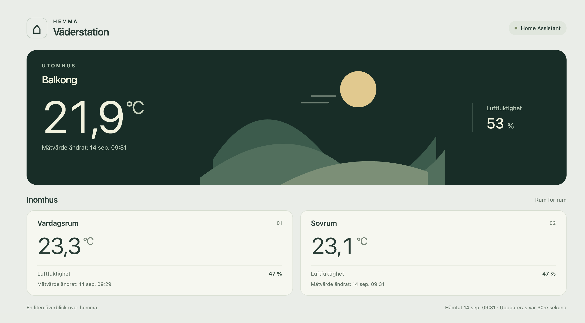
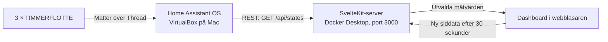

# Väderstation

Svensk dashboard för temperatur och luftfuktighet, byggd med SvelteKit, Svelte 5
och TypeScript. Layouten är anpassad till 1280 × 720 och staplar rumskorten på
mindre skärmar. Balkong visas som huvudvärde, med Vardagsrum och Sovrum under.



Dokumentationen beskriver implementationen och den verifierade Mac-installationen
per **2026-09-14**. Raspberry Pi-drift är planerad och ännu inte verifierad.

## Status och genomförda val

- Projektet började med mockdata för ute, vardagsrum, sovrum och kontor.
  Nu hämtas riktiga värden från tre TIMMERFLOTTE-sensorer via Home Assistant.
- Slutliga områden är **Balkong, Vardagsrum och Sovrum**. Den givare som först
  kallades Kök används som Vardagsrum, enligt bekräftad mappning i Home Assistant.
- Lufttryck har tagits bort eftersom våra givare bara tillhandahåller temperatur
  och luftfuktighet. Landskapsbilden är dekorativ och visar ingen väderprognos.
- Dashboarden kör i Docker Desktop. Home Assistant OS kör separat i VirtualBox.
  Det ursprungliga förslaget att även köra Home Assistant i Docker ersattes av
  Home Assistant OS för installationen med Matter.
- Enkel REST-hämtning används framför WebSocket. Ingen databas, historiklagring,
  gemensam servercache eller bakgrundspollning finns i dashboarden.
- Mockleverantören är borttagen. Typen `source` och visningen har kvar stöd för
  etiketten `mock`, men ingen konfigurationsinställning aktiverar ett demoläge.

## Arkitektur



Thread-trafiken passerar hemmets Thread-gränsrouter. DIRIGERA och Apple TV finns
i installationen; exakt vilken gränsrouter som bär respektive sensors trafik har
inte verifierats. Alla tre sensorer är enligt användaren anslutna till Apple Hem
och har därefter lagts till i Home Assistant. Dashboarden kommunicerar endast med
Home Assistant, aldrig direkt med Apple Hem, DIRIGERA eller sensorerna.

### Server och webbläsare

1. `+page.server.ts` anropar `getWeatherSnapshot()` vid sidladdning.
2. Servern läser privata miljövariabler via `$env/dynamic/private` och anropar
   `/api/states` med en Bearer-token. Anropet har 8 sekunders timeout och tillåter
   inte omdirigeringar.
3. Svaret innehåller alla tillstånd från Home Assistant. Servern väljer ut de sex
   konfigurerade entity-ID:na och returnerar en `WeatherSnapshot` till sidan.
   Token och övriga Home Assistant-tillstånd skickas inte till webbläsaren.
4. Efter att sidan monterats hämtar webbläsaren ny siddata med `invalidateAll()`.
   Nästa uppdatering schemaläggs 30 sekunder efter att föregående försök avslutats.
   Varje öppen dashboardflik gör egna anrop; stängda flikar pollar inte.

## Teknik och projektstruktur

| Del               | Val                                                              |
| ----------------- | ---------------------------------------------------------------- |
| Webbapp           | SvelteKit 2, Svelte 5, TypeScript 5                              |
| Byggverktyg       | Vite 8 och Svelte-plugin 7                                       |
| Produktionsserver | `@sveltejs/adapter-node` 5                                       |
| Node              | Node 22 i `.nvmrc` och Docker; `package.json` kräver minst 22.12 |
| Pakethantering    | npm; exakta installerade versioner finns i `package-lock.json`   |
| Formatering       | Prettier med Svelte-plugin                                       |
| Utseende          | Egen CSS, systemtypsnitt och inline-SVG; inget UI-bibliotek      |

```text
src/
├── app.html                       # Svenskt HTML-dokument
├── app.css                        # Layout och responsiva brytpunkter
├── lib/
│   ├── server/weather.ts          # API-anrop, mappning och felhantering
│   └── weather/types.ts           # SensorReading och WeatherSnapshot
└── routes/
    ├── +layout.svelte             # Gemensam CSS
    ├── +page.server.ts            # Serverns dataladdning
    └── +page.svelte               # Presentation och uppdateringstimer
Dockerfile
docker-compose.yml
.env.example
```

### Datamodell och felbeteende

`SensorReading` innehåller `id`, `name`, `temperature`, `humidity` och `updatedAt`.
`WeatherSnapshot` innehåller `source`, `outdoor`, `rooms`, `fetchedAt` och `error`.

- Temperatur anges i °C; °F konverteras. Andra temperaturenheter avvisas.
- Luftfuktighet måste anges i % och ligga mellan 0 och 100.
- Saknade entiteter, tomma värden, `unknown`, `unavailable` och ogiltiga tal eller
  enheter ger `null`, vilket visas som ett streck. Övriga givare visas fortfarande.
- Saknad adress/token ger meddelandet att Home Assistant inte är konfigurerad.
- Nätverksfel, timeout och HTTP-fel ger ett generellt anslutningsfel. Ett fel på
  autentiseringen visas alltså inte separat. Ingen automatisk mockfallback finns.
- Vid ett misslyckat API-anrop skapas normalt en ny ögonblicksbild med tomma värden
  och varning. Om webbläsarens hämtning från dashboardservern misslyckas behålls
  tidigare siddata med varning.

”Mätvärde ändrat” visar den äldsta giltiga `last_updated` av platsens tillgängliga
mätvärden. Det är inte ett bevis på senaste radiokontakt; ett oförändrat värde kan
ha en gammal tidsstämpel. Ingen automatisk åldersgräns för gamla värden finns ännu.
”Hämtat” anger när hämtningsförsöket startade, även om försöket misslyckades.
Tider visas i `Europe/Stockholm`, temperatur med en decimal och luftfuktighet
avrundad till heltal.

## Nuvarande Home Assistant-installation

- MacBook Pro med M3 Pro och 18 GB RAM.
- VirtualBox 7.2.16 med Home Assistant OS 18.2, ARM64-VDI.
- Virtuell maskin: 4096 MB RAM, 2 processorer, EFI och VirtioSCSI.
- Nätverk: Bridged Adapter via Macens Wi-Fi (`en0`).
- Home Assistant nås på **http://homeassistant.local**, port **80**.
  Port 8123 i det första `.env`-exemplet fungerade inte i denna installation.
- Vid första starten fanns både en tom VirtualBox-disk och HAOS-disken anslutna.
  Felsökningen omfattade att ta bort den tomma diskanslutningen och använda
  HAOS-disken på port 0. Installationen bekräftades därefter fungera; den exakta
  orsaken till de tidigare swap-felen fastställdes inte.

VirtualBox-inställningar, HAOS-disk, sensorkopplingar, Home Assistant-konto och
Home Assistant-backuper ingår inte i detta repo. De behöver hanteras separat.
Docker Compose startar endast dashboarden. På Mac behöver även Home Assistant-VM:n
vara igång och datorn vaken för kontinuerlig drift.

Referenser: [Home Assistant på Mac](https://www.home-assistant.io/installation/macos/),
[Matter](https://www.home-assistant.io/integrations/matter/),
[REST API](https://developers.home-assistant.io/docs/api/rest/).

## Konfiguration

Skapa `.env` från `.env.example` endast första gången. Exempelfilen innehåller
platshållare; redigera sedan **`.env`** med rätt värden.

| Variabel                 | Betydelse / aktuell konfiguration                                  |
| ------------------------ | ------------------------------------------------------------------ |
| `ORIGIN`                 | Dashboardens externa adress: `http://localhost:3000`               |
| `HOME_ASSISTANT_URL`     | Home Assistants basadress: `http://homeassistant.local`            |
| `HOME_ASSISTANT_TOKEN`   | Långlivad åtkomsttoken från Home Assistant-profilen; endast lokalt |
| `HA_BALCONY_TEMPERATURE` | Balkongens temperatur-entitet                                      |
| `HA_BALCONY_HUMIDITY`    | Balkongens fukt-entitet                                            |
| `HA_ROOM_NAME`           | `Vardagsrum`; standardvärdet i koden är också Vardagsrum           |
| `HA_ROOM_TEMPERATURE`    | Vardagsrummets temperatur-entitet                                  |
| `HA_ROOM_HUMIDITY`       | Vardagsrummets fukt-entitet                                        |
| `HA_BEDROOM_TEMPERATURE` | Sovrummets temperatur-entitet                                      |
| `HA_BEDROOM_HUMIDITY`    | Sovrummets fukt-entitet                                            |

Bekräftad sensormappning 2026-09-14:

| Plats      | Temperatur                                          | Luftfuktighet                                    |
| ---------- | --------------------------------------------------- | ------------------------------------------------ |
| Balkong    | `sensor.timmerflotte_temp_hmd_sensor_temperature`   | `sensor.timmerflotte_temp_hmd_sensor_humidity`   |
| Vardagsrum | `sensor.timmerflotte_temp_hmd_sensor_temperature_3` | `sensor.timmerflotte_temp_hmd_sensor_humidity_3` |
| Sovrum     | `sensor.timmerflotte_temp_hmd_sensor_temperature_2` | `sensor.timmerflotte_temp_hmd_sensor_humidity_2` |

Entity-ID:n kan ändras vid omparkoppling eller namnbyte. Kontrollera dem under
Home Assistants Utvecklarverktyg → Tillstånd. Suffixen är inte rumsnamn; mappningen
ovan verifierades mot områdena i Home Assistant.

`.env` ignoreras av Git och utesluts från Docker-byggkontexten. Compose läser in
filen som runtime-miljövariabler. Servern läser token privat; den ska inte läggas i
`PUBLIC_`-variabler, README eller klientkod. Nuvarande trafik använder HTTP på det
lokala nätverket. Dashboarden har ingen egen inloggning och Compose publicerar port
3000 på värddatorns nätverksgränssnitt. Ingen internetpublicering är konfigurerad.

## Lokal utveckling

```sh
git clone https://github.com/rosieboy/weather-station.git
cd weather-station
nvm use
npm ci
cp .env.example .env # Endast om .env inte redan finns!
# Fyll i .env enligt tabellerna ovan.
npm run dev -- --open
```

Öppna http://localhost:5173. Utvecklingsservern kan köras samtidigt som Docker-appen
på port 3000. Kodändringar syns direkt i utvecklingsläget, men kräver ombygge i Docker.

| Kommando               | Funktion                                                    |
| ---------------------- | ----------------------------------------------------------- |
| `npm run check`        | Svelte- och TypeScript-kontroll                             |
| `npm run build`        | Bygger produktionsservern till `build/`                     |
| `npm start`            | Kör bygget och läser `.env` om den finns; normalt port 3000 |
| `npm run preview`      | Förhandsvisar bygget via Vite                               |
| `npm run format`       | Formaterar projektet                                        |
| `npm run format:check` | Kontrollerar formateringen                                  |

Stoppa Docker-appen före `npm start`, eller välj en annan port, exempelvis
`PORT=3001 ORIGIN=http://localhost:3001 npm start`.

## Docker-drift

```sh
docker compose up -d --build # Bygg och starta efter kodändringar
docker compose ps           # Kontrollera status
docker compose logs -f      # Följ loggar; Ctrl+C stoppar bara loggvisningen
docker compose down         # Stoppa och ta bort dashboardcontainern
```

Öppna http://localhost:3000. Efter ändring i `.env`, kör `docker compose up -d`
för att applicera konfigurationen; en vanlig omstart läser inte in en ändrad fil.

Dockerfilen bygger med `node:22-bookworm-slim`, installerar med `npm ci`, kör
kontroll och bygge, och kopierar endast `build/` och `package.json` till runtime-steget.
Alla nuvarande appberoenden bundlas. Om externa produktionsberoenden tillkommer måste
runtime-steget även installera dem. Basimagen är en rörlig Node 22-tagg, inte låst
med digest. Bygget använder värdmaskinens arkitektur; basimagen finns för ARM64/AMD64.

Containern kör som användaren `node`, lyssnar på `0.0.0.0:3000` och har
`init: true` samt `restart: unless-stopped`. Ingen hälsokontroll eller datavolym
finns. Dashboarden sparar ingen egen historik. Att stoppa den påverkar inte Home
Assistant-VM:n eller sensorkopplingarna.

Om `.local` inte kan lösas inne i Docker, sätt `HOME_ASSISTANT_URL` till Home
Assistants LAN-IP och reservera gärna adressen i routern. Använd inte `localhost`
som Home Assistant-adress inne i dashboardcontainern: det pekar på containern själv.

## Verifierat och återstående

Genomförda kontroller vid integrationsarbetet 2026-09-14:

- Svelte-/TypeScript-kontroll och produktionsbygge, även inne i Docker.
- Startad container och verkliga mätvärden för alla tre områden i webbläsaren.
- Kontroll att token inte fanns i dashboardens HTML-svar.
- Separata körda kontroller av Fahrenheit-konvertering, saknade/otillgängliga
  givare, HTTP 401 och nätverksfel. Dessa var engångskontroller; repot har ännu
  ingen permanent automatiserad testsvit eller CI-konfiguration.

Vid beroendekontrollen 2026-09-13 rapporterade `npm audit` tre varningar med låg
allvarlighetsgrad från SvelteKits indirekta `cookie`-beroende. Det är en daterad
kontroll, inte en aktuell säkerhetsgaranti. Appen sätter inga egna cookies.
`npm audit fix --force` föreslog då en olämplig nedgradering.

Återstår inför apparaten:

- Välj driftupplägg på Raspberry Pi: dashboardens Linux/Docker-installation och
  Home Assistant OS-installationen är separata upplägg och behöver planeras ihop.
  Dagens Compose-fil installerar inte Home Assistant.
- Verifiera bygge och drift på fysisk Pi, skärmrotation och faktisk skärmupplösning.
- Konfigurera kioskstart och återstart efter strömavbrott.
- Planera Home Assistant-backup/flytt och kontrollera entity-ID:n efter migrering.
- Vid behov: permanent testsvit, historik, WebSocket och bättre indikering av
  sensorernas tillgänglighet. Dessa funktioner finns inte i nuvarande version.
