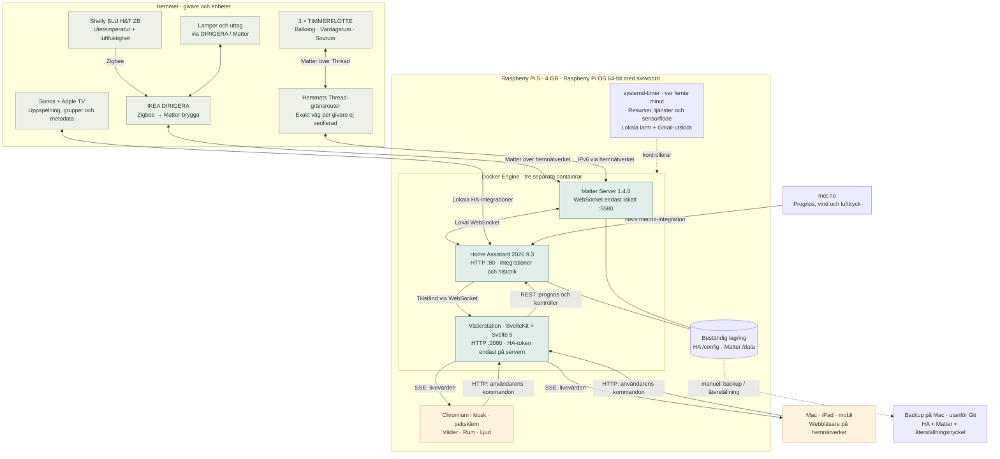
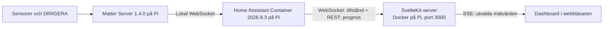
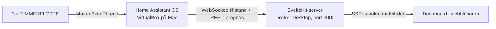

# Väderstation

Svensk dashboard för temperatur och luftfuktighet, byggd med SvelteKit, Svelte 5
och TypeScript. Väder, Rum och Ljud är anpassade för Pi:ns kiosk på 1280 × 720
och fungerar även på mindre skärmar. Utetemperaturen är vädervyns huvudvärde,
med Vardagsrum, Sovrum och Balkong under.


Drift verifierad på Raspberry Pi per **2026-09-23**.
Dashboard: http://vaderstation.local:3000/ · Home Assistant: http://vaderstation.local/

Se [Pi-guiden](RASPBERRY-PI.md), [flytthistoriken](HA-MIGRATION.md) och
[HA/Matter-drift](deploy/home-assistant/README.md).

## Idéer och vägval

[GEMINI.md](GEMINI.md) bevarar samtalet med Gemini, med separata faktakommentarer,
designreferenser och förslag kring en framtida fysisk volymkontroll.

[COPILOT.md](COPILOT.md) beskriver en granskning av projektet.

## Status och genomförda val

- Projektet började med mockdata för ute, vardagsrum, sovrum och kontor.
  Nu hämtas riktiga värden från tre TIMMERFLOTTE-sensorer och en separat
  utomhusgivare via Home Assistant: **Shelly BLU H&T ZB**, ansluten via DIRIGERA.
- Temperaturgivarna finns i **Balkong, Vardagsrum och Sovrum**. Den givare som först
  kallades Kök används som Vardagsrum, enligt bekräftad mappning i Home Assistant.
- De egna givarna tillhandahåller temperatur och luftfuktighet. met.no bidrar med
  jämförelsetemperatur, lufttryck, trycktrend, vind och prognos. Landskapsbilden följer väder och soltid.
- Dashboard, HA Container och Matter Server kör i separata containrar på Pi:n.
  Macens tidigare HA OS i VirtualBox är stoppad och sparad för återgång.
  Den får inte köras samtidigt med den återställda Pi-installationen.
- Sensorflödet använder WebSocket och SSE sedan 2026-09-14. Ingen databas eller historiklagring finns. Prognoser cachas i 15 minuter på servern; sensorvärden uppdateras via händelser.
- Mockleverantören är borttagen. Typen `source` och visningen har kvar stöd för
  etiketten `mock`, men ingen konfigurationsinställning aktiverar ett demoläge.

### Gränssnitt och teman (2026-09-26)

- Vädervyn visar stora mätvärden utan mät- och prognostidsstämplar. Hela
  prognosraden är en knapp som växlar mellan sex dygn och sex timmar. Temperatur
  och luftfuktighet i de tre väderkortens rum ligger på samma baslinje; den
  visuella fuktetiketten är borttagen men finns kvar för skärmläsare.
- Rumskorten är helt klickbara och visar lampstatus, temperatur och luftfuktighet.
  Dialogen har större brytare och dimmerspår; pågående kommandon och fel visas,
  medan lyckade kommandon inte lämnar kvar en statusrad. Feedbackytan behåller
  sin höjd så dialogen inte hoppar vid styrning.
- Ljudvyn har större spelknappar, en fylld touchvänlig volymstapel och tydligare
  låt- och artisttext. Tidsrad och statiska uppspelningstexter visas inte längre;
  volymkommandot skickas fortfarande först när reglaget släpps.
- De tre vyerna har egna färgpaletter för dag och natt. `deep-ambient` använder
  svart bakgrund och dämpat rött i alla vyer, inklusive reglage och dialoger.
  Rumskort och högtalarkort får en diskret röd ram och skugga som framhävs vid
  hover eller tryck, utan att påverka övriga vyer och teman.
  Det aktiveras automatiskt **23:00–07:59 i Europe/Stockholm**, oavsett sparat
  manuellt temaval. Från 08:00 gäller åter det tidigare manuella valet eller
  Auto-lägets solstyrda dag/natt. Temaknappen växlar fortfarande Auto → Natt →
  Dag; ambient är inget separat manuellt val.

## Visualisering


## Arkitektur

### Aktuell installation – allt kör på Raspberry Pi



Dashboard: **http://vaderstation.local:3000/** · HA: **http://vaderstation.local/**.
Macens tidigare HA-VM är stoppad och behövs inte för drift. Extern åtkomst och
schemalagd extern backup är ännu inte installerade. Systemd-kontrollen mejlar larm och återhämtningar via Gmail, men kan inte
larma när Pi:n är strömlös.

Modellnamnet är **Shelly BLU H&T ZB** (inte Shelby). Givaren stöder Zigbee och
Bluetooth; i vår installation går den via DIRIGERA. Se
[tillverkarens produktinformation](https://www.shelly.com/products/shelly-blu-h-t-zb).

### Tidigare översiktsbild (bevarad)

Den förenklade bilden nedan bevaras som tidigare dokumentationsversion.
Den hade redan uppdaterats till Pi-drift; den ursprungliga Mac-arkitekturen visas
separat under den.



### Ursprunglig utvecklingsmiljö på Mac (historik)



Thread-trafiken passerar hemmets Thread-gränsrouter. DIRIGERA och Apple TV finns
i installationen; exakt vilken gränsrouter som bär respektive sensors trafik har
inte verifierats. Alla tre sensorer är enligt användaren anslutna till Apple Hem
och har därefter lagts till i Home Assistant. Dashboarden kommunicerar endast med
Home Assistant, aldrig direkt med Apple Hem, DIRIGERA eller sensorerna.

### Server och webbläsare

1. En gemensam anslutning per serverprocess öppnas mot Home Assistants
   `/api/websocket` och autentiseras med token på servern.
2. Servern prenumererar på `state_changed` och läser därefter `get_states`.
   Händelser under inläsningen buffras. Konfigurerade väderentiteter samt lampor, brytare, knapphändelser, mediaspelare
   och temperatur-/fuktsensorer lagras i minnet; borttagna entiteter tas bort ur cachen.
3. `+page.server.ts` ger sidan ett första läge. Vid kallstart kan anslutningen
   fortfarande pågå; nästa strömmade uppdatering fyller i värdena.
4. Webbläsaren öppnar `EventSource('/api/events')`. Server-Sent Events (SSE)
   skickar normaliserad siddata när relevanta tillstånd ändras. Token och andra
   Home Assistant-entiteter skickas inte till webbläsaren.
5. WebSocket kontrolleras med ping/pong var 20:e sekund. Uteblivet svar leder
   till återanslutning. Uppstart har 10 sekunders timeout; återförsök använder
   ökande väntetid från 1 till 30 sekunder och läser om hela startläget.
6. Vid avbrott behålls senast mottagna värden med varning. Felaktig token ger
   ett särskilt meddelande. Webbläsaren återansluter SSE automatiskt, med 3 sekunders
   angiven väntetid. SSE skickar även en livssignal var 15:e sekund.

Sensorerna REST-pollas inte längre. Prognoser hämtas fortsatt med REST och
15 minuters cache. En timer för varje öppen SSE-ström uppdaterar prognosvyn var
15:e minut även om sensorerna inte ändras. Stängda flikar städar upp prenumerationer
och timers. Home Assistant-anslutningen hålls kvar tills serverprocessen stoppas;
under lokal utveckling stängs den också vid modulbyte.

## Teknik och projektstruktur

| Del               | Val                                                              |
| ----------------- | ---------------------------------------------------------------- |
| Webbapp           | SvelteKit 2, Svelte 5, TypeScript 5                              |
| Byggverktyg       | Vite 8 och Svelte-plugin 7                                       |
| Produktionsserver | `@sveltejs/adapter-node` 5                                       |
| Node              | Node 22 i `.nvmrc` och Docker; `package.json` kräver minst 22.12 |
| Pakethantering    | npm; exakta installerade versioner finns i `package-lock.json`   |
| Formatering       | Prettier med Svelte-plugin                                       |
| Utseende          | Egen CSS, systemtypsnitt och inline-SVG; inget UI-bibliotek      |

```text
src/
├── app.html                       # Svenskt HTML-dokument
├── app.css                        # Layout och responsiva brytpunkter
├── lib/
│   ├── server/weather.ts          # API-anrop, mappning och felhantering
│   └── weather/types.ts           # SensorReading och WeatherSnapshot
└── routes/
    ├── +layout.svelte             # Gemensam CSS
    ├── +page.server.ts            # Serverns dataladdning
    └── +page.svelte               # Presentation och uppdateringstimer
Dockerfile
docker-compose.yml
.env.example
```

### Datamodell och felbeteende

`SensorReading` innehåller `id`, `name`, `temperature`, `humidity` och `updatedAt`.
`WeatherSnapshot` samlar sensorer, väder, prognoser, astronomi, hämtningstid och fel
samt `home` med rum och lampkontroller. `HomeSnapshot` och `HomeRoom` finns i
`src/lib/home/types.ts`.

- Temperatur anges i °C; °F konverteras. Andra temperaturenheter avvisas.
- Luftfuktighet måste anges i % och ligga mellan 0 och 100.
- Saknade entiteter, tomma värden, `unknown`, `unavailable` och ogiltiga tal eller
  enheter ger `null`, vilket visas som ett streck. Övriga givare visas fortfarande.
- Saknad adress/token ger meddelandet att Home Assistant inte är konfigurerad.
- Avbrott mot Home Assistant visas med varning; senast mottagna sensorvärden
  behålls tills anslutningen har återställts och ett nytt startläge lästs in.
- Saknad adress/token och nekad autentisering ger tydliga meddelanden.
- Vid avbrott mellan webbläsare och server behålls siddata med en separat varning.

`updatedAt` innehåller den äldsta giltiga `last_updated` av platsens
tillgängliga mätvärden. Det är inte ett bevis på senaste radiokontakt; ett
oförändrat värde kan ha en gammal tidsstämpel. Ingen automatisk åldersgräns
för gamla värden finns ännu. Kiosk-vyn visar inte dessa tidsstämplar.
`fetchedAt` anger när servern sammanställde siddata, inte sensorns rapporttid.
Klocka och temafönster använder `Europe/Stockholm`.

## Tidigare Home Assistant-installation på Mac (historik)

- MacBook Pro med M3 Pro och 18 GB RAM.
- VirtualBox 7.2.16 med Home Assistant OS 18.2, ARM64-VDI.
- Virtuell maskin: 4096 MB RAM, 2 processorer, EFI och VirtioSCSI.
- Nätverk: Bridged Adapter via Macens Wi-Fi (`en0`).
- Home Assistant nås på **http://homeassistant.local**, port **80**.
  Port 8123 i det första `.env`-exemplet fungerade inte i denna installation.
- Vid första starten fanns både en tom VirtualBox-disk och HAOS-disken anslutna.
  Felsökningen omfattade att ta bort den tomma diskanslutningen och använda
  HAOS-disken på port 0. Installationen bekräftades därefter fungera; den exakta
  orsaken till de tidigare swap-felen fastställdes inte.

VirtualBox-inställningar, HAOS-disk, sensorkopplingar, Home Assistant-konto och
Home Assistant-backuper ingår inte i detta repo. De behöver hanteras separat.
Rotens Docker Compose startar endast dashboarden. HA och Matter hanteras nu
separat i `~/home-assistant` på Pi:n; konfigurationen finns i `deploy/home-assistant`.
Macen behöver inte vara vaken för den aktuella driften.

Referenser: [Home Assistant på Mac](https://www.home-assistant.io/installation/macos/),
[Matter](https://www.home-assistant.io/integrations/matter/),
[REST API](https://developers.home-assistant.io/docs/api/rest/).

## Konfiguration

Skapa `.env` från `.env.example` endast första gången. Exempelfilen innehåller
platshållare; redigera sedan **`.env`** med rätt värden.

| Variabel                 | Betydelse / aktuell konfiguration                                  |
| ------------------------ | ------------------------------------------------------------------ |
| `ORIGIN`                 | Dashboardens externa adress: `http://localhost:3000`               |
| `HOME_ASSISTANT_URL`     | Home Assistants basadress: `http://homeassistant.local`            |
| `HOME_ASSISTANT_TOKEN`   | Långlivad åtkomsttoken från Home Assistant-profilen; endast lokalt |
| `HA_OUTDOOR_TEMPERATURE` | Separata utomhusgivarens temperatur-entitet                        |
| `HA_OUTDOOR_HUMIDITY`    | Separata utomhusgivarens fukt-entitet                              |
| `HA_BALCONY_TEMPERATURE` | Balkongens temperatur-entitet                                      |
| `HA_BALCONY_HUMIDITY`    | Balkongens fukt-entitet                                            |
| `HA_ROOM_NAME`           | `Vardagsrum`; standardvärdet i koden är också Vardagsrum           |
| `HA_ROOM_TEMPERATURE`    | Vardagsrummets temperatur-entitet                                  |
| `HA_ROOM_HUMIDITY`       | Vardagsrummets fukt-entitet                                        |
| `HA_BEDROOM_TEMPERATURE` | Sovrummets temperatur-entitet                                      |
| `HA_BEDROOM_HUMIDITY`    | Sovrummets fukt-entitet                                            |

Bekräftad sensormappning 2026-09-14:

| Plats      | Temperatur                                          | Luftfuktighet                                    |
| ---------- | --------------------------------------------------- | ------------------------------------------------ |
| Balkong    | `sensor.timmerflotte_temp_hmd_sensor_temperature`   | `sensor.timmerflotte_temp_hmd_sensor_humidity`   |
| Vardagsrum | `sensor.timmerflotte_temp_hmd_sensor_temperature_3` | `sensor.timmerflotte_temp_hmd_sensor_humidity_3` |
| Sovrum     | `sensor.timmerflotte_temp_hmd_sensor_temperature_2` | `sensor.timmerflotte_temp_hmd_sensor_humidity_2` |

Entity-ID:n kan ändras vid omparkoppling eller namnbyte. Kontrollera dem under
Home Assistants Utvecklarverktyg → Tillstånd. Suffixen är inte rumsnamn; mappningen
ovan verifierades mot områdena i Home Assistant.

`.env` ignoreras av Git och utesluts från Docker-byggkontexten. Compose läser in
filen som runtime-miljövariabler. Servern läser token privat; den ska inte läggas i
`PUBLIC_`-variabler, README eller klientkod. Nuvarande trafik använder HTTP på det
lokala nätverket. Dashboarden har ingen egen inloggning och Compose publicerar port
3000 på värddatorns nätverksgränssnitt. Ingen internetpublicering är konfigurerad.

## Lokal utveckling

```sh
git clone https://github.com/rosieboy/weather-station.git
cd weather-station
nvm use
npm ci
cp .env.example .env # Endast om .env inte redan finns!
# Fyll i .env enligt tabellerna ovan.
npm run dev -- --open
```

Öppna http://localhost:5173. Utvecklingsservern kan köras samtidigt som Docker-appen
på port 3000. Kodändringar syns direkt i utvecklingsläget, men kräver ombygge i Docker.

| Kommando               | Funktion                                                    |
| ---------------------- | ----------------------------------------------------------- |
| `npm run check`        | Svelte- och TypeScript-kontroll                             |
| `npm run build`        | Bygger produktionsservern till `build/`                     |
| `npm start`            | Kör bygget och läser `.env` om den finns; normalt port 3000 |
| `npm run preview`      | Förhandsvisar bygget via Vite                               |
| `npm run format`       | Formaterar projektet                                        |
| `npm run format:check` | Kontrollerar formateringen                                  |

Stoppa Docker-appen före `npm start`, eller välj en annan port, exempelvis
`PORT=3001 ORIGIN=http://localhost:3001 npm start`.

## Docker-drift

```sh
docker compose up -d --build # Bygg och starta efter kodändringar
docker compose ps           # Kontrollera status
docker compose logs -f      # Följ loggar; Ctrl+C stoppar bara loggvisningen
docker compose down         # Stoppa och ta bort dashboardcontainern
```

Öppna http://localhost:3000. Efter ändring i `.env`, kör `docker compose up -d`
för att applicera konfigurationen; en vanlig omstart läser inte in en ändrad fil.

Dockerfilen bygger med `node:22-bookworm-slim`, installerar med `npm ci`, kör
kontroll och bygge, tar bort utvecklingsberoenden och kopierar `build/`,
`package.json` samt produktionsberoenden (bland annat SunCalc) till runtime-steget. Basimagen är en rörlig Node 22-tagg, inte låst
med digest. Bygget använder värdmaskinens arkitektur; basimagen finns för ARM64/AMD64.

Containern kör som användaren `node`, lyssnar på `0.0.0.0:3000` och har
`init: true` samt `restart: unless-stopped`. Ingen hälsokontroll eller datavolym
finns. Dashboarden sparar ingen egen historik. Att stoppa den påverkar inte Home
Assistant-VM:n eller sensorkopplingarna.

Om `.local` inte kan lösas inne i Docker, sätt `HOME_ASSISTANT_URL` till Home
Assistants LAN-IP och reservera gärna adressen i routern. Använd inte `localhost`
som Home Assistant-adress inne i dashboardcontainern: det pekar på containern själv.

## Verifierat och återstående

Genomförda kontroller vid integrationsarbetet 2026-09-14:

- Svelte-/TypeScript-kontroll och produktionsbygge, även inne i Docker.
- Startad container och verkliga mätvärden för alla tre områden i webbläsaren.
- Kontroll att token inte fanns i dashboardens HTML-svar.
- Separata körda kontroller av Fahrenheit-konvertering, saknade/otillgängliga
  givare, HTTP 401 och nätverksfel. Dessa var engångskontroller; dessa kompletteras nu av `npm test` för WebSocket-transporten. CI är inte konfigurerat.

Vid beroendekontrollen 2026-09-13 rapporterade `npm audit` tre varningar med låg
allvarlighetsgrad från SvelteKits indirekta `cookie`-beroende. Det är en daterad
kontroll, inte en aktuell säkerhetsgaranti. Appen sätter inga egna cookies.
`npm audit fix --force` föreslog då en olämplig nedgradering.

Återstående kontroller och framtida arbete:

- Återkommande backup utanför Pi:n och provåterställning.
- Lokal Bluetooth är inte konfigurerad; nätverksanslutna enheter fungerar.
- Fjärråtkomst utanför hemnätverket är inte installerad.

## Prognos, jämförelsetemperatur och astronomi (2026-09-14)

Den egna utomhussensorn är fortfarande huvudvärdet. met.no visas mindre bredvid,
märkt **beräknad temperatur**, eftersom värdet inte är vår lokala mätning.
Vid byte av utomhusgivare ändras `HA_OUTDOOR_TEMPERATURE` och `HA_OUTDOOR_HUMIDITY` till
den nya givarens entity-ID:n; den egna sensorn behåller huvudrollen.

- `HA_WEATHER_ENTITY=weather.forecast_hem` väljer den befintliga met.no-entiteten.
- `HA_MOON_ENTITY=sensor.moon_fas` väljer Moon-sensorn. Home Assistants lokala
  Moon-integration lades till vid detta arbete.
- Nästa soluppgång och solnedgång hämtas från `sun.sun`, med datum så att morgondagens
  uppgång inte förväxlas med dagens. Tidszonen är fortsatt Europe/Stockholm.
- Sex prognoskolumner visar dygn (max/min) eller timmar. Hela prognosraden
  växlar läge vid tryck. Nederbörd visas som sannolikhet i procent, inte mängd.
- Prognosen hämtas via `POST /api/services/weather/get_forecasts?return_response`
  för `daily` och `hourly`. Detta är en datahämtande Home Assistant-action.
- Lyckade prognossvar cachas i 15 minuter i serverprocessens minne. Cachen försvinner
  vid omstart. Misslyckade prognoser visas som otillgängliga och provas igen vid
  nästa siduppdatering. Sensorvärden fungerar även om prognoshämtningen misslyckas.
- `src/lib/server/forecast.ts` normaliserar prognoser och hanterar cache;
  `src/lib/weather/labels.ts` innehåller svenska väder- och månfasnamn.

Dashboarden anropar bara Home Assistant. met.no-integrationen sköter externa
väderanrop och platskonfiguration. Källan anges i sidfoten. Inga koordinater eller
åtkomsttoken skickas till klienten av den nya funktionen. Ingen exakt Eve-modell
eller dess entity-ID:n är konfigurerade ännu.

### Verifiering av direktuppdatering

`npm test` testar en delad transport, händelser under startinläsning, filtrering,
borttagna entiteter, återanslutning med nytt startläge och autentiseringsfel med
simulerad WebSocket. `src/lib/server/ha-stream.ts` hanterar transporten och
`src/routes/api/events/+server.ts` hanterar SSE och klienternas städning.
Ingen ny miljövariabel krävs. Node 22:s inbyggda WebSocket används.

Vid framtida reverse proxy måste `/api/events` kunna strömmas utan buffring och
utan kort timeout. Endpointen skickar `X-Accel-Buffering: no` och cacheförbud.
En flerprocessinstallation får en Home Assistant-anslutning per process;
nuvarande Docker-installation kör en process.

## Dag- och nattläge samt kompletterande väderdata

Knappen i sidhuvudet växlar Auto → Natt → Dag. Valet sparas lokalt i webbläsaren.
Auto använder solhändelserna i `sun.sun` (se detaljer nedan), med solstatus som reserv.
Saknas solstatus används dagläge. Vid anslutningsavbrott behålls senast mottagna
solstatus tills anslutningen återkommer. Mellan 23:00 och 08:00 svensk tid tar
`deep-ambient` tillfälligt över alla tre vyerna, även vid ett sparat Dag/Natt-val.
Temat ändrar färgerna, inte skärmens hårdvaruljusstyrka.

met.no-panelen visar även lufttryck i hPa, vind i m/s och kompassriktning (varifrån
vinden blåser). Kända enheter konverteras; saknade/okända enheter visas som streck.
Lufttryck och trend finns kvar i serverns data men visas inte i kiosk-vyn.

Stora panelen visar den separata utomhusgivaren. Raden Hemma visar riktiga
värden för Vardagsrum, Sovrum och Balkong.

### Solstyrning, klocka, trycktrend och väderbild (2026-09-16)

Auto följer i första hand `sun.sun.attributes.next_rising` och `next_setting`,
inte enbart `sun.sun.state`. Alla jämförelser använder absoluta UTC-tidpunkter;
klockan och solhändelserna formateras i Europe/Stockholm med automatisk sommartid.
Skärmens klocka synkroniseras mot serverns `fetchedAt` vid varje SSE-meddelande och
räknar vidare varje sekund. Växlingen sker vid solhändelsen, utan förskjutning,
även om just det WebSocket-meddelandet dröjer. Saknas en användbar tidplan används
solstatusen som reserv, och saknas även den används dagläge. En helt utgången
plan extrapoleras inte till nästa dygn. Manuell färginställning påverkar inte
landskapets faktiska dag/natt.

Vid kontroll 16 september stämde Mac, Docker och Home Assistants klockor överens;
HA:s tidszon var Europe/Stockholm. `sun.sun` rapporterade fortfarande
`last_changed` från 14 september och `below_horizon`, trots uppdaterade solattribut.
Det är en konstaterad avvikelse i solstatusen; orsaken till att den fastnat är
inte fastställd. Den kan förklara tidigt nattläge i den tidigare implementationen.

Trycktrenden hämtar Recorder-historik för samma met.no-entitet tre timmar före
det aktuella vädervärdets `last_updated`. Resultatet är hPa-differensen: mer än
+0,5 stigande, mindre än −0,5 fallande, annars stabilt. Historiksvaret cachelagras
15 minuter per aktuellt värde, samtidiga anrop samordnas. Det kräver historik med
tryckattribut i HA; saknad historik, API-fel eller ett aktuellt värde äldre än
90 minuter ger ”Trycktrend saknas”. Inget separat datalager behövs på dashboarden.
Trenden beskriver met.no-värden, inte en lokal barometer eller en vädervarning.

`WeatherScene.svelte` är stilla SVG med samma landskap och färgpalett som tidigare.
Den visar sol/måne, stjärnor, moln, regn, snö/hagel, dimma, vind och åska efter
met.no:s väderkod samt soltid. Månformen är en stiliserad tolkning av månfasen,
inte en astronomiskt exakt återgivning. Okänt väder visar en neutral miljö.
Grafiken ändras bara när dess indata ändras, utan animation eller egna nätanrop.
Befintlig 15-minutersuppdatering och livehändelser används; solväxlingen väntar
inte på nästa 15-minutersintervall.

## Rum och lampkontroller (2026-09-17)

Knapparna **Väder / Rum / Ljud** byter skärm. Ett horisontellt svep åt vänster öppnar
rummen och åt höger återgår till vädret. Svep byter inte skärm när en rumsdialog
är öppen eller när gesten börjar på ett reglage. Vyn återgår till väder vid omladdning.
Dag-/nattläget gäller båda vyerna och dialogerna.

Rumsöversikten hämtas från Home Assistants områdes-, enhets- och entitetsregister.
Entitetens uttryckliga område prioriteras före enhetens område. Ändra namn och
placering i Home Assistant; ingen separat rumskonfiguration behövs i `.env`.
Registret cachas i 60 sekunder och läses därefter om vid nästa datauppdatering,
sidöppning eller kontrollkommando. Tillstånd uppdateras löpande via den gemensamma
WebSocket-anslutningen och SSE. Registerändringar har ingen egen prenumeration.

Vid kontroll finns åtta rum och 14 lamp-uttag: Kök, Vardagsrum, Balkong, Sovrum,
Ellens rum, Matrum, Hall och Gång. TV-rum har tagits bort i HA och visas inte separat.
Rum utan lampor visas också. Styrbara enheter utan område hamnar under **Utan rum**.
Temperatur och fukt på rumskorten kommer från rummets första giltiga sensor per
mätstorhet. Balkongens värden är riktiga i både rumsvyn och vädervyn.

Tryck på ett rum för att öppna dess dialog. Där finns individuella på/av-reglage
samt **Tänd alla / Släck alla**. Styrbara enheter är `light.*` och Matter-brytare
med klassen `outlet`, eftersom installationens uttag används till lampor.
Dolda, avaktiverade och diagnostik-/konfigurationsentiteter filtreras bort.
Sonos-inställningsbrytare inkluderas inte. Om uttag för andra apparater tillkommer
måste urvalet anpassas innan de används här.

Fjärrkontroller räknas per fysisk enhet utifrån knapphändelser; de visas inte som
styrbara lampor. Deras befintliga kopplingar och automationer ändras inte.
Sonos visas som antal högtalarenheter per rum; musikstyrning finns i Ljud-vyn.

### Kommandon och felhantering

`POST /api/home/control` accepterar bara `turn_on` eller `turn_off` för en känd
lampa eller ett känt rum. Servern skickar motsvarande REST-action till HA;
reglagens tillstånd bekräftas genom WebSocket-flödet, utan optimistisk uppdatering.
Enheter utan kontakt hoppas över vid gruppkommandon. Kontroller blockeras vid
anslutningsfel och medan ett kommando skickas. Ett delvis misslyckat gruppkommando
kan ha påverkat några enheter; dialogen ber då användaren kontrollera status.

Token stannar på servern. Endpointen accepterar endast appens `ORIGIN` samt adresser som uttryckligen anges
i `CONTROL_ALLOWED_ORIGINS` (kommaseparerade fullständiga ursprung, med protokoll
och port, utan sökväg). Exempel: `http://192.168.1.10:3000`. Då fungerar både
localhost och den angivna LAN-adressen. Inga jokertecken tillåts. Starta om
Docker med `docker compose up -d` efter konfigurationsändring. Detta är
CSRF-skydd, inte inloggning. Godtyckliga serviceanrop accepteras inte.
Appen saknar egen inloggning och är avsedd för det betrodda hemnätverket; besökare
som når dashboarden kan styra de valda lamporna.

- `src/lib/server/home-model.ts`: rumsurval, enhetsmappning och tillåtna mål.
- `src/lib/server/home.ts`: registerhämtning över befintlig WebSocket och cache.
- `src/lib/components/RoomsView.svelte`: rumskort, dialoger och reglage.
- `src/routes/api/home/control/+server.ts`: validering och HA-kommandon.
- `tests/home.test.mjs`: urval, områdesprioritet, fjärrkontrollräkning och målval.

`npm test` omfattar även registerkommandon och avbrott i WebSocket-transporten.

## Ljud och Sonos (2026-09-17)

Den tredje vyn visar ett kort per aktiv, synlig Sonos-mediaspelare i HA-registret.
Apple TV filtreras bort. Kortens områden följer HA; enhetens eget namn kan avvika
(exempelvis Sonos-namnet TV-rum i området Vardagsrum). Inga nya miljövariabler krävs.
Svep går stegvis mellan Väder → Rum → Ljud, utan att slå runt i ändarna.

- Spela/pausa, föregående/nästa spår, tystning och individuell volym 0–100 %.
  Volymanrop skickas när reglaget släpps, inte kontinuerligt under dragningen.
- Källmenyn använder enhetens `source_list`: i denna installation ingår Sonos-
  favoriter, radiostationer och spellistor samt TV/Line-in på enheter som erbjuder det.
  Att välja en källa kan starta uppspelning. Detta är ingen fullständig musiksökning;
  konton och favoritlistor hanteras fortfarande i Sonos-appen.
- **Gruppera** öppnar en dialog där andra högtalare läggs till i vald spelares
  befintliga grupp. Den befintliga gruppledarens ljud används. **Lämna** kopplar
  loss en högtalare. Volymen gäller respektive enhet; ingen gemensam gruppvolym finns.
- Uppspelning och källval riktas till gruppledaren (först i `group_members`).
  Gruppstatus, spår och volym kommer från samma WebSocket/SSE-flöde som övrig data.
  Grupperingen visas först när HA rapporterar den; ett skickat kommando är inte
  i sig en bekräftelse på ändrad uppspelning.

`src/lib/server/audio-model.ts` normaliserar ett begränsat antal offentliga fält
och validerar varje kommando. `/api/audio/control` accepterar endast kända Sonos-
enheter, stödda funktioner, giltig volym och källor ur aktuell lista. Gruppmedlemmar
valideras också. Samma ursprung krävs, token stannar på servern, inga godtyckliga
medie-URL:er eller serviceanrop vidarebefordras. Avbrott blockerar kontrollerna.

`AudioView.svelte` innehåller kort och gruppdialog. Grafiken är CSS, utan externa
omslagsbilder eller nya bibliotek. Dag-/nattläget följer resten av dashboarden.
Tester täcker enhetsurval, validering, gruppledare och otillgängliga gruppmedlemmar.
Dokumentation: [Sonos](https://www.home-assistant.io/integrations/sonos/) och
[Media player](https://www.home-assistant.io/integrations/media_player/).

Verifierat: 14 automatiska tester och produktionsbygge, layout i 1280 × 720,
gruppering av två vilande Sonos-enheter följt av urgruppering samt volymändring
5 → 6 → 5 % i köket, med återrapporterad status. Uppspelning och källbyte har inte
provats med hörbart ljud under utvecklingen; tillgängliga källor har lästs från HA.

### Sonos-felsökning 2026-09-17

Vid fastnad låtinformation visade HA:s REST-tillstånd och dashboardens SSE samma
äldre låt, artist och källa. Omladdning av enbart Sonos-integrationen gav ny
låtinformation direkt. Loggen innehöll utgångna Sonos-prenumerationer som inte
kunde förnyas. HA:s UTC-klocka låg samtidigt cirka 76 minuter efter Macen;
orsaken till tidsavvikelsen är ännu inte löst. Den kan påverka prenumerationer
men ett orsakssamband är inte verifierat. Upprepad REST-hämtning av tillstånd eller
`homeassistant.update_entity` återställde inte informationen före omladdningen.

Vissa källbyten gav dessutom Sonos UPnP-fel 402 (Invalid Args). Användaren har
identifierat utgången TuneIn-åtkomst för vissa favoriter och rensar dem i Sonos.
Appen väljer bara bland HA:s aktuella lista och kan inte kontrollera abonnemang.

Källbyten tillåts nu ta 35 sekunder på servern (tidigare 8), övriga ljudkommandon
15 sekunder. Klienten väntar upp till 45 sekunder. Ett avvisat serviceanrop visas
som avvisat, medan timeout/nätfel markeras som osäkert resultat: kommandot kan
fortfarande utföras av HA. Inga automatiska återförsök skickas. Ett lyckat svar
bekräftar behandlat kommando, inte att nya låtuppgifter har mottagits. Tester
skiljer avvisade svar från osäkra timeout-resultat och kontrollerar källbytets tidsgräns.

### Låtinformation (2026-09-18; vy uppdaterad 2026-09-26)

Ljudkorten visar gruppledarens låt och artist även när uppspelningen startas utanför
Tidsrad, spelad tid, total längd och platshållaren ”Tidsinformation saknas” har
tagits bort ur spelarkorten för att ge större plats åt titel och kontroller.

När Sonos tar emot TV-ljud kan dess metadata enbart vara ”TV”. För en bekräftad
Apple TV → TV → Sonos-koppling finns två frivilliga inställningar:

- `HA_SONOS_TV_ENTITY`: Sonos-enheten som tar emot TV-ljudet.
- `HA_TV_METADATA_ENTITY`: Apple TV-mediaspelaren i HA.

Båda lämnas tomma om kopplingen inte är känd. Vi gissar inte från rumsnamn eller
vilken app som råkar spela. När den konfigurerade Sonos-enhetens källa är TV och
Apple TV är playing/paused med titel, används dess låtmetadata och tidsuppgifter.
Källans metadata visas inte som en separat etikett i spelarkortet. Gruppmedlemmarna
visar samma information via gruppledaren.
Källval, volym och uppspelningskommandon fortsätter gå till Sonos som tidigare.
Om TV:n byter till en annan ingång medan Apple TV fortsätter spela kan den explicita
kopplingen visa fel metadata; ingen TV-ingångsstatus är integrerad ännu.

Aktiverad och bekräftad koppling: `media_player.tv_rum_tv_rum` tar TV-ljudet;
`media_player.vardagsrum_vardagsrum` lämnar Apple TV-metadata.

### Levande väderscen

SVG-scenen har långsamt drivande moln, regn/snö, dimma och vattenrörelse. Met.no:s tillstånd styr illustrationen och vindstyrkan påverkar molnhastigheten. Ingen väderfilm eller extern bildtjänst används. Reducerad rörelse respekteras och animationerna pausas när webbsidan är dold; scenen avmonteras i Rum/Ljud.

Solens och månens positioner och månfas beräknas på servern med [SunCalc 1.9](https://github.com/mourner/suncalc/tree/v1.9.0). HA:s `get_config` ger Hem-positionen, som cachas i en timme. Koordinater skickas inte till webbläsaren. Positioner uppdateras via SSE minst varje minut och interpoleras visuellt. Prognosens befintliga cache gäller fortfarande. Om platsen inte kan hämtas visas inga gissade himlakroppar.

Illustrationen är ett stiliserat panorama: azimut 45–315° går från vänster till höger, nordliga riktningar kläms till kanterna och höjd över horisonten styr vertikalleden. Det är inte en exakt fönsterutsikt. Månen kan synas även dagtid och döljs under horisonten. Solens synlighet använder −0,83° som ungefärlig soluppgångsgräns. Landskap och moln kan skymma kropparna. Positionerna är astronomiska approximationer, inte observationer; terräng ingår inte. Pi-prestanda återstår att verifiera på hårdvaran.

### Dimning av lampor och ljusgrupper

Rumsvyn visar ett reglage 1–100 % för `light`-enheter vars `supported_color_modes`
anger stöd för ljusstyrka. Detta gäller också HA-ljusgrupper, exempelvis
`light.kokso_tak`: gruppen får ett enda `light.turn_on` med `brightness_pct`.
Nivån skickas när reglaget släpps, och bekräftat värde hämtas via WebSocket.
Släckta lampor visar 0 %; att dra reglaget tänder dem på vald nivå. Av/på-knappen
används för att släcka. Uttag får inga dimmerkommandon. Färgtemperatur och färg
ändras inte av reglaget.

## Installation på Raspberry Pi

Se [RASPBERRY-PI.md](RASPBERRY-PI.md) för Raspberry Pi OS 64-bit med skrivbord,
Docker, privat konfiguration, LAN-åtkomst och automatisk kioskvisning.

### Ergonomi i gränssnittet (2026-09-25)

Sekundär text och flera kontrollknappar har fått större text och tryckytor.
Rums- och grupperingsdialogernas stängknappar använder centrerade SVG-kryss i
stället för ett tecken vars placering varierar mellan typsnitt och plattformar.
Sidor med fler rum eller högtalare kan rullas vertikalt; långa dialoger har egen
touch-rullning och en rubrik som ligger kvar överst. På pekskärmar som skickar
muspekare går det även att dra i bakgrunden eller på rumskort för att rulla.
Svep i sidled byter vy. Musliknande pekhändelser låses till sidled eller lodled
när draget börjar, så reservrullningen inte avbryter ett snett sid-svep.
På smala skärmar staplas väderdetaljer och rumskort och prognosen använder två
kolumner. På 1280 × 720 ryms Väder, Rum respektive Ljud utan horisontell
rullning. Väderillustrationen ligger bakom huvudvärdet och dämpas i
`deep-ambient` för att inte konkurrera med mätvärdena.

## Separat utomhusgivare (2026-09-23)

Huvudvärdet använder `HA_OUTDOOR_TEMPERATURE` och `HA_OUTDOOR_HUMIDITY`,
kopplade till `sensor.utetemperatur_temperatur` och
`sensor.utetemperatur_luftfuktighet`. Balkongkortet använder de befintliga
`HA_BALCONY_*`-entiteterna och visar riktiga TIMMERFLOTTE-värden. Det tidigare
fasta mockkortet är borttaget. Båda givarna uppdateras via HA:s WebSocket.

### Bekräftat omstartstest

Användaren har bekräftat att omstart efter HA-flytten fungerar. Efter drygt fyra
timmars drift såg allt bra ut; användarens diagnostik visade rimlig minnesanvändning,
temperatur och gott om diskutrymme. [Regelbunden hälsokontroll](deploy/health/README.md) är installerad och verifierad
2026-09-23. Systemd-timern kör var femte minut och loggar lokala larm; Gmail-utskick är aktiverade och verifierade 2026-09-24.
